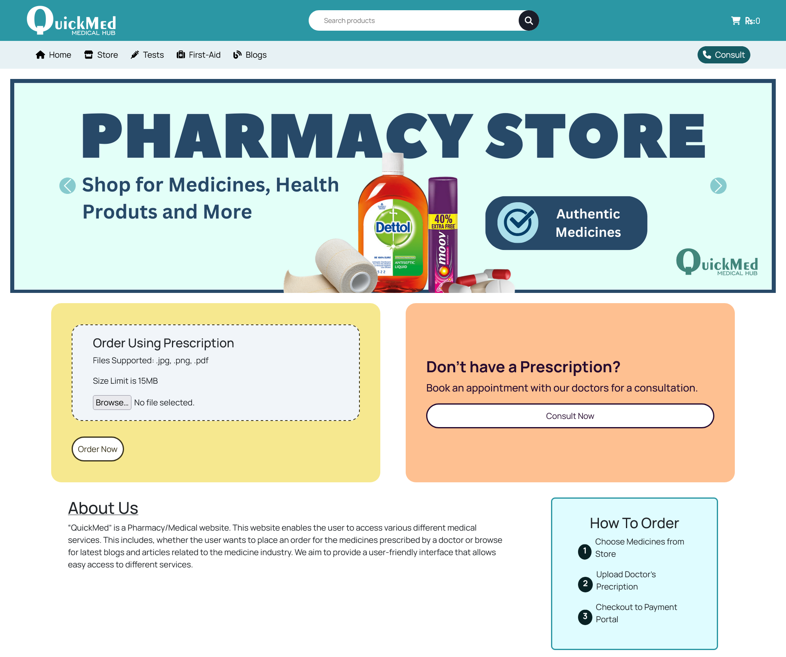

<a id="readme-top"></a>
<!-- PROJECT LOGO -->
<br />
<div align="center">
  <a href="https://github.com/arpitcs/quickmed">
    
  </a>

  <h3 align="center">Front-End Development Project</h3>

  <p align="center">
    All-In-One Medical Hub Website
    <br />
    <a href="https://arpitcs.github.io/QuickMed"><strong>View Demo</strong></a>
    <br />
    <br />
  </p>
</div>

<!-- TABLE OF CONTENTS -->
<details>
  <summary>Table of Contents</summary>
  <ol>
    <li>
      <a href="#about-the-project">About The Project</a>
      <ul>
        <li><a href="#features-of-website">Features of Website</a></li>
        <li><a href="#built-with">Built With</a></li>
      </ul>
    </li>
    <li><a href="#installation">Installation</a></li>
    <li><a href="#usage">Usage</a></li>
    <li><a href="#purpose">Purpose</a></li>
  </ol>
</details>


<!-- ABOUT THE PROJECT -->
## About The Project



“QuickMed” is a Pharmacy/Medical website. This website enables the user to access various different medical services. This includes, whether the user wants to place an order for the medicines prescribed by a doctor or browse for latest blogs and articles related to the medicine industry. We aim to provide a user-friendly interface that allows easy access to different services.

### Features of Website
* E-Commerce Webpage to Order Medicines and Health Products Online
* Online Doctor Consultation Form to book Appointment with Experts for Remote Diagnosis
* Lab Tests Catalogue to Order Blood Test Bundles
* First-Aid Webpage to learn more about Emergency Treatment
* Health Blogs to stay updated on the latest Health News and Articles

The Aim of this Website is to Provide Users with a All-In-One Medical Hub to access all these services.

<p align="right">(<a href="#readme-top">Back To Top</a>)</p>


### Built With

This is the Technical Stack used to Make this Project <br />
[![HTML][html.com]][HTML-url] <br />
[![CSS][css.com]][CSS-url] <br />
[![JavaScript][javascript.com]][JavaScript-url] <br />
[![Bootstrap][Bootstrap.com]][Bootstrap-url] <br />

<p align="right">(<a href="#readme-top">back to top</a>)</p>


<!-- GETTING STARTED -->
## Installation

This is an example of how you may give instructions on setting up your project locally.
To get a local copy up and running follow these simple example steps.

1. Clone the repo
   ```sh
   git clone https://github.com/ArpitCS/QuickMed.git
   ```
2. Run the Folder using a Local Server Tool (Ex. Live Server by Microsoft)

<p align="right">(<a href="#readme-top">Back To Top</a>)</p>


<!-- USAGE EXAMPLES -->
## Usage

### E-Commerce Medicine Store


### Lab Test Booking


### First-Aid Guide


### Blogs


<p align="right">(<a href="#readme-top">Back To Top</a>)</p>


## Purpose
This Project was Submitted in Partial Fulfillment of the Requirement for the Award of Bachelors of Engineering (B.E.) Degree in Computer Science (C.S.) @ Chitkara University, Punjab (INDIA) By,
<ul>
    <li><a href="github.com/ArpitCS">Arpit Garg</a></li>
    <li><a href="github.com/anirudhbecse">Anirudh Chaudhary</a></li>
    <li><a href="github.com/abhishek20k5">Abhishek Kumar</a></li>
    <li><a href="github.com/aryan1628be28">Aryan</a></li>
</ul>

<p align="right">(<a href="#readme-top">Back To Top</a>)</p>

<!-- MARKDOWN LINKS & IMAGES -->
<!-- https://www.markdownguide.org/basic-syntax/#reference-style-links -->

[Bootstrap.com]: https://img.shields.io/badge/Bootstrap-563D7C?style=for-the-badge&logo=bootstrap&logoColor=white
[Bootstrap-url]: https://getbootstrap.com
[HTML.com]: https://img.shields.io/badge/HTML5-E34F26?style=for-the-badge&logo=html5&logoColor=white
[HTML-url]: https://developer.mozilla.org/en-US/docs/Web/HTML
[CSS.com]: https://img.shields.io/badge/CSS-239120?style=for-the-badge&logo=css3&logoColor=white
[CSS-url]: https://developer.mozilla.org/en-US/docs/Web/CSS
[JavaScript.com]: https://img.shields.io/badge/JavaScript-F7DF1E?style=for-the-badge&logo=javascript&logoColor=black
[JavaScript-url]: https://developer.mozilla.org/en-US/docs/Web/JavaScript